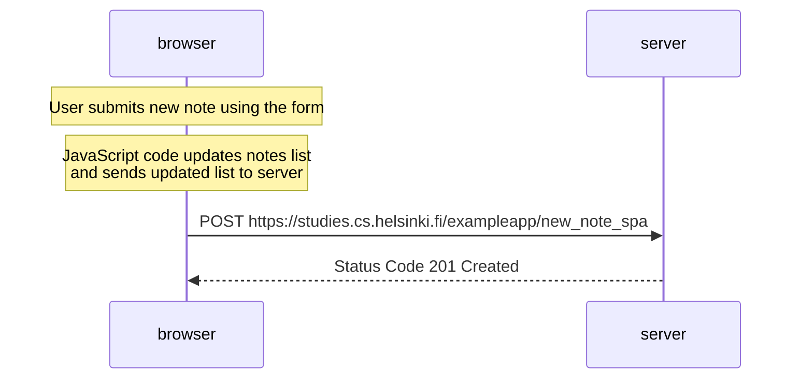

```mermaid
sequenceDiagram
    participant browser
    participant server
    
    Note over browser: User submits new note using the form
    Note over browser: JavaScript code updates notes list <br/> and sends updated list to server
    browser->>server: POST https://studies.cs.helsinki.fi/exampleapp/new_note_spa
    server-->>browser: Status Code 201 Created
```
