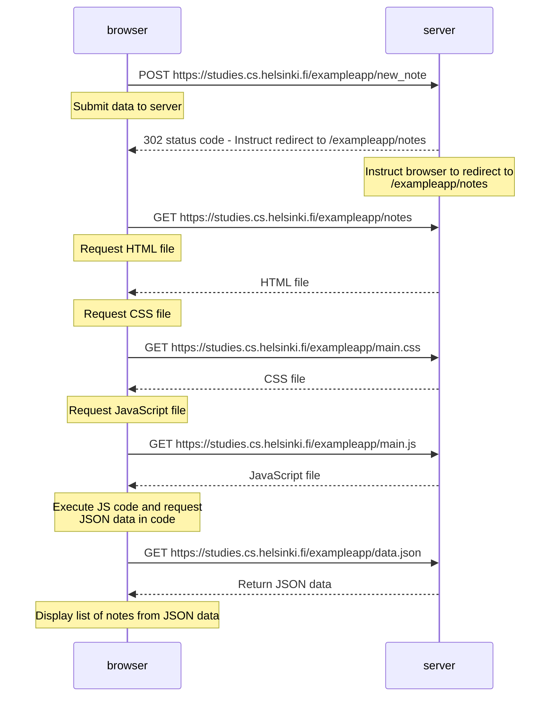

```mermaid
sequenceDiagram
    participant browser
    participant server

    browser->>server: POST https://studies.cs.helsinki.fi/exampleapp/new_note
    Note over browser: Submit data to server
    server-->>browser: 302 status code - Instruct redirect to /exampleapp/notes
    Note over server: Instruct browser to redirect to <br/> /exampleapp/notes

    browser->>server: GET https://studies.cs.helsinki.fi/exampleapp/notes
    Note over browser: Request HTML file
    server-->>browser: HTML file
    
    Note over browser: Request CSS file
    browser->>server: GET https://studies.cs.helsinki.fi/exampleapp/main.css
    server-->>browser: CSS file

    Note over browser: Request JavaScript file
    browser->>server: GET https://studies.cs.helsinki.fi/exampleapp/main.js
    server-->>browser: JavaScript file

    Note over browser: Execute JS code and request <br/> JSON data in code

    browser->>server: GET https://studies.cs.helsinki.fi/exampleapp/data.json
    server-->>browser: Return JSON data

    Note over browser: Display list of notes from JSON data
```
